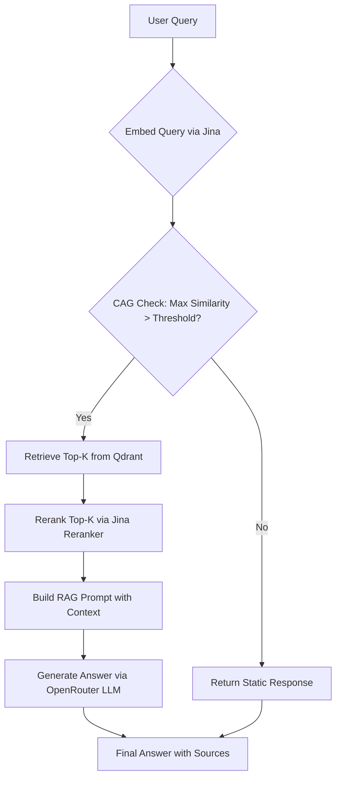

alphahct\README.md
# RAG Backend with CAG and Reranking

A minimal yet functional Retrieval-Augmented Generation (RAG). Implements a context-aware gate (CAG) and reranking for efficient and accurate question answering.

## Features

- **Document Ingestion**: Supports raw text and PDF files with semantic chunking.
- **Vector Embeddings**: Uses Jina AI's `jina-embeddings-v4` via their HTTP API for text vectorization.
- **Vector Storage**: Qdrant for efficient similarity search.
- **Context-Aware Gate (CAG)**: Pre-retrieval check to decide if RAG is needed based on max similarity score.
- **Retrieval & Reranking**: Retrieves top-k chunks, reranks using Jina `jina-reranker-v3` for better relevance.
- **Generative QA**: Leverages OpenRouter (compatible with OpenAI API) for final answer generation with grounding instructions.
- **API-Driven**: No heavy local ML models; everything via APIs for scalability.

## Architecture

The pipeline follows this flow:



### Key Components

- **Embeddings (Jina AI)**: Handles query/doc vectorization (2048-dim).
- **Vector DB (Qdrant)**: Stores chunks as points with cosine similarity.
- **Reranker (Jina AI)**: Improves retrieval relevance.
- **Generative LLM (OpenRouter)**: Produces answers based strictly on provided context.
- **Gate (CAG)**: Avoids unnecessary RAG for out-of-scope queries.

## Prerequisites

- Python 3.9+ (tested on 3.11.9)
- Docker (for Qdrant)
- API Keys:
  - Jina AI (embeddings & reranker)
  - OpenRouter (generative LLM)

## Installation

1. Clone the repository:
   ```bash
   git clone https://github.com/your-repo/alphahct.git
   cd alphahct
   ```

2. Create a virtual environment:
   ```bash
   python -m venv venv
   venv\Scripts\activate  # Windows
   # or source venv/bin/activate  # Unix
   ```

3. Install dependencies:
   ```bash
   pip install -r requirements.txt
   ```

4. Set up Qdrant via Docker:
   ```bash
   docker compose up -d
   ```
   Access dashboard at http://localhost:6333/dashboard.

## Configuration

Environment variables are loaded from `.env` (copy from `.env-example`):

```bash
cp .env-example .env
# Edit .env with your keys
```

Required variables:

- **Qdrant**:
  - `QDRANT_URL=http://localhost:6333`
  - `QDRANT_VECTOR_SIZE=2048`
  - `QDRANT_COLLECTION=documents`

- **Jina AI**:
  - `JINA_API_KEY=your_jina_key`
  - `JINA_EMBEDDING_EXPECTED_DIM=2048`

- **Jina Reranker**:
  - `JINA_RERANKER_API_KEY=your_jina_key`  # Can reuse JINA_API_KEY
  - `JINA_RERANKER_TOP_K=5`

- **OpenRouter**:
  - `OPENROUTER_API_KEY=your_openrouter_key`
  - `OPENROUTER_MODEL=openrouter/polaris-alpha`

- **CAG & RAG Tuning**:
  - `CAG_THRESHOLD=0.5`  # Similarity threshold for CAG
  - `RETRIEVAL_TOP_K=10`  # Initial retrieval
  - `RERANKED_TOP_K=5`  # After reranking
  - `MAX_CONTEXT_CHARS=4000`

## Running the Application

1. Ensure Qdrant is running:
   ```bash
   docker compose ps
   ```

2. Start the FastAPI server:
   ```bash
   uvicorn app.main:app --host 0.0.0.0 --port 8000
   ```

3. Access API docs: http://127.0.0.1:8000/docs (Swagger UI)

## API Usage

### Ingest Document

#### Text
```bash
POST /ingest/text
Content-Type: application/json

{
  "text": "Your document text here.",
  "source": "optional-source"
}
```
Response:
```json
{
  "doc_id": "uuid",
  "num_chunks": 3
}
```

#### PDF
```bash
POST /ingest/pdf
Content-Type: multipart/form-data

# Upload PDF file with key "file"
```
Response: Same as text.

### Query

```bash
POST /query
Content-Type: application/json

{
  "query": "Your question here?"
}
```

Response:
```json
{
  "answer": "Generated answer or static response.",
  "answerable": true,
  "cag_max_score": 0.74,
  "retrieved_contexts": [
    {
      "text": "Chunk text...",
      "score": 0.74,
      "doc_id": "uuid",
      "chunk_index": 0,
      "source": "upload"
    }
  ]
}
```

### Notes
- CAG Score > CAG_THRESHOLD → RAG executed; else static answer.
- If `answerable: false`, answer is refusal message.
- Contexts include reranked top-5.

## Example Workflow

1. Ingest a document:
   ```bash
   curl -X POST http://127.0.0.1:8000/ingest/text \
     -H "Content-Type: application/json" \
     -d '{"text": "The film Tokyo Drifter was released in 1966 and directed by Seijun Suzuki.", "source": "film-db"}'
   ```

2. Ask a question:
   ```bash
   curl -X POST http://127.0.0.1:8000/query \
     -H "Content-Type: application/json" \
     -d '{"query": "In what year was Tokyo Drifter released?"}'
   ```
   Expected: `"answer": "The film Tokyo Drifter was released in 1966."`

3. Ask out-of-scope:
   ```bash
   curl -X POST http://127.0.0.1:8000/query \
     -H "Content-Type: application/json" \
     -d '{"query": "What is the capital of France?"}'
   ```
   Expected: Static response if CAG score low.

## Development

- Code structure:
  - `app/main.py`: FastAPI app & endpoints.
  - `app/embeddings.py`: Jina embeddings.
  - `app/reranker.py`: Jina reranker.
  - `app/generative_llm.py`: OpenRouter integration.
  - `app/vectorstore.py`: Qdrant helpers.
  - `app/splitter.py`: Text chunking.

- Testing: Run with sample data; ensure API keys are set.
- Contributing: Add type hints, docstrings; keep minimal.


